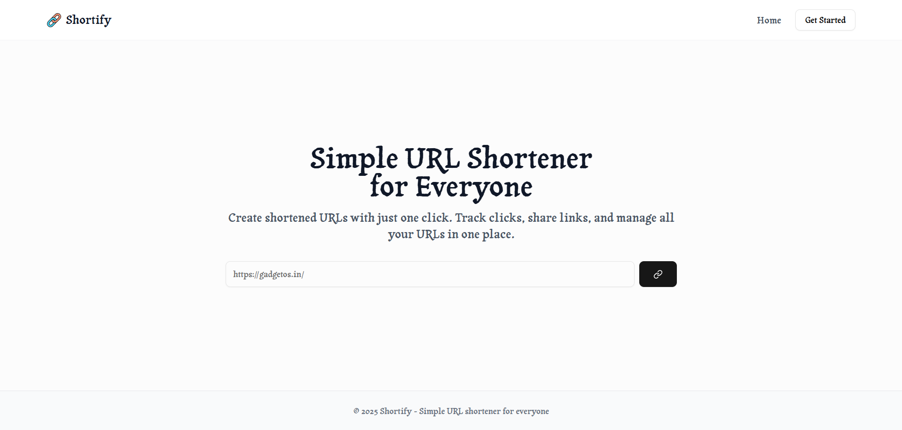
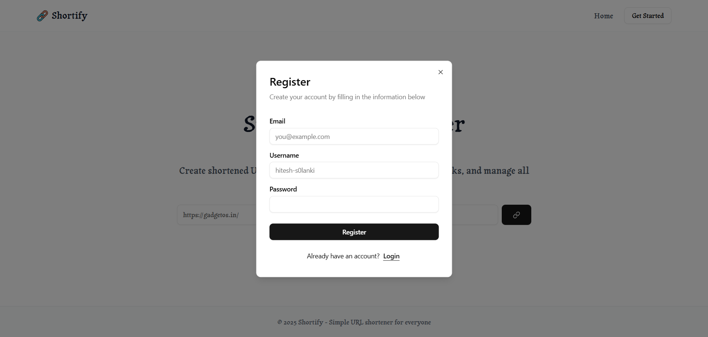
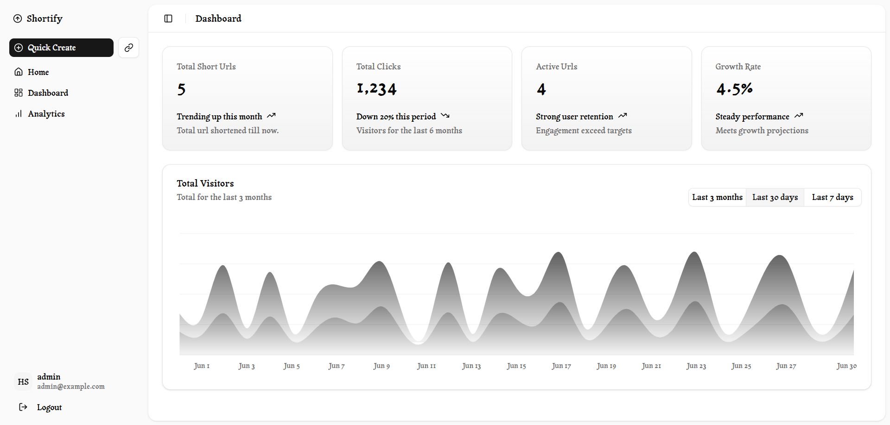

# 🔗 URL Shortener (Shortify)

A modern, full-stack URL shortening application that enables users to convert lengthy URLs into concise, shareable links. Built with a focus on scalability, performance, and seamless deployment, this project leverages containerization and cloud infrastructure for efficient CI/CD workflows.



---

## 🚀 Features

* Shorten long URLs into compact links
* Redirect users to the original URL upon accessing the short link
* Track analytics such as click counts and creation dates
* User-friendly interface for managing links
* Secure authentication using JWT
---

## 🛠️ Tech Stack

**Frontend:**

* React.js (Vite)
* Tailwind CSS
* ShadCN UI
* Redux
* Recharts.js

**Backend:**

* Java
* Spring Boot
* Spring Security
* JWT
* MySQL

**DevOps & Deployment:**

* Docker
* AWS Elastic Container Service (ECS)
* GitHub Actions for CI/CD

---

## 📸 Screenshots

### Auth Page



### Analytics Dashboard



---

## 🧰 Getting Started

### Prerequisites

* Node.js and npm installed
* Java 17 or higher
* Docker installed
* MySQL database instance

### Installation

1. **Clone the repository:**

   ```bash
   git clone https://github.com/Hitesh-s0lanki/url-shortener.git
   cd url-shortener
   ```

2. **Set up environment variables:**

   * Create a `.env` file in both `frontend/` and `backend/` directories.
   * Refer to `.env.example` files for required variables.

3. **Install dependencies:**

   **Frontend:**

   ```bash
   cd frontend
   npm install
   ```

   **Backend:**

   ```bash
   cd ../backend
   ./mvnw clean install
   ```


4. **Run the application:**

   **Frontend:**

   ```bash
   npm run dev
   ```

   **Backend:**

   ```bash
   ./mvnw spring-boot:run
   ```


The frontend will be accessible at `http://localhost:3000` and the backend API at `http://localhost:8080`.

---

## 🐳 Docker Deployment

1. **Build Docker images:**

   ```bash
   docker-compose build
   ```

2. **Run containers:**

   ```bash
   docker-compose up
   ```


The application will be available at `http://localhost:3000`.

---

## ☁️ AWS ECS Deployment

The application is containerized and deployed on AWS ECS using Fargate. CI/CD pipelines are configured with GitHub Actions to automate the build and deployment process.


---

## 🔧 CI/CD Pipeline

Continuous Integration and Deployment are handled via GitHub Actions:

1. **Code Push:** Triggers the CI pipeline.
2. **Build & Test:** Runs tests and builds Docker images.
3. **Push to Registry:** Uploads images to Amazon ECR.
4. **Deploy to ECS:** Updates the ECS service with the new image.

---

## 🔮 Future Enhancements

* Implement user authentication and authorization
* Add support for custom short URLs
* Integrate with Redis for caching
* Enhance analytics with geolocation and device data
* Develop a browser extension for quick URL shortening

---

## 🤝 Contributing

Contributions are welcome! Please fork the repository and submit a pull request for any enhancements or bug fixes.

---

For more information, visit the [GitHub Repository](https://github.com/Hitesh-s0lanki/url-shortener).

---
